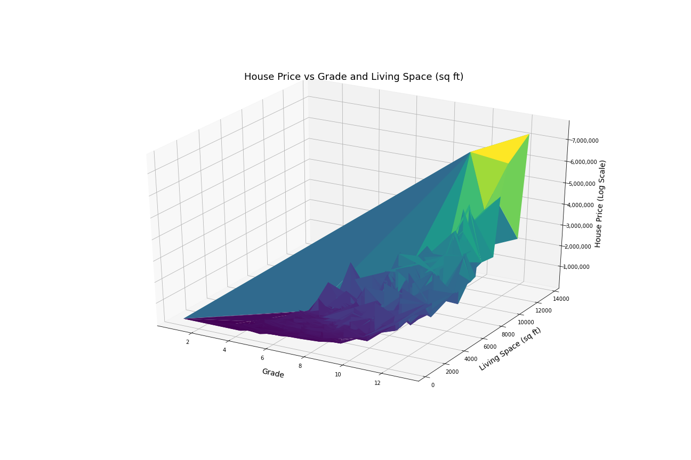
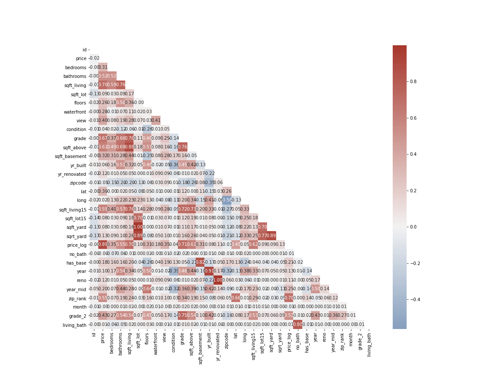

# wax_yelp_project
## Introduction
Students at Flatiron Data Science Intensive Bootcamp Feb 1 cohort 1 were tasked with analyzing data on housing prices in King County, performing feature engineering on the dataset provided, building models to predict housing prices, and running predictions on an unknown data set. This is their Phase 2 Project.

## Scikit-learn API
This project is a chance to showcase the power of Scikit-learn. To create and run the models, I used the Linear Regression toolkit and various metrics from this library.

https://scikit-learn.org/

## Methology
For slicing and analyzing data, I used Pandas and Numpy. I used Matplotlib and SeaBorn for data visualization.
I leveraged SciPy to perform statistical tests.

Through visualizations and statistical analysis I performed feature engineering to find the best set of features with which to build a house price model.
I also gathered housing price data for King County zip codes from [this file](https://washington.hometownlocator.com/zip-codes/countyzips,scfips,53033,c,king.cfm "WA HomeTownLocator") to assist with the modeling.

I used R-squared analysis to check that a model was successfully built, and compared the RMSE (root mean squared error) to determine how close of a fit the model was. I compared the model output against the original training data set; I also used train-test-split to segment the data set into random training and test subsets with which to build and run models.

To properly model with zip codes, which are a categorical feature, I created dummy variables. I further used Polynomial Regression and Recursive Feature Elimination to drop unneeded features.

## Conclusion
Despite the housing price data obtained, the model showed worse performance that zip code dummy variables.

From my testing, the best model fit (without overfitting) was achieved by using most of the original features as well as the engineered features.

## Predictions
Using my final model, I predicted housing prices on the holdout dataset (kc_house_data_test_features.csv) and saved it as (housing_preds_wei_alex_xin.csv). Results of this prediction are pending.
